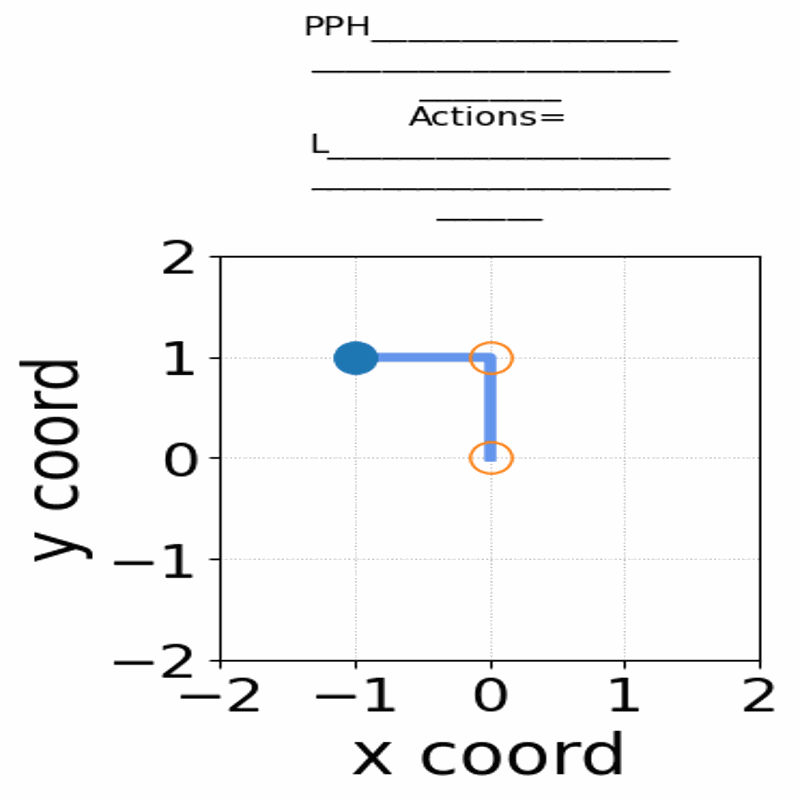
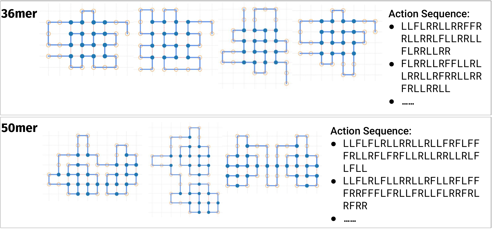

# Applying Deep Reinforcement Learning to the HP Model for Protein Structure Prediction


_Gif of 48mer folding to a conformation with best-known enegry of -23_

## Publication

This repository contains source code for the publication:
> Applying Deep Reinforcement Learning to the HP Model for Protein Structure Prediction

- Extended abstract is accepted at the **[Machine Learning and the Physical Sciences workshop, NeurIPS 2022](https://ml4physicalsciences.github.io/2022/)**

> [Poster](https://neurips.cc/media/PosterPDFs/NeurIPS%202022/56887.png) and [Extended Abstract](https://ml4physicalsciences.github.io/2022/files/NeurIPS_ML4PS_2022_20.pdf)

- Ful manuscript is published at journal **Physica A: Statistical Mechanics and its Applications** Volume 609, 1 January 2023, 128395:

**DOI of Physica A**
> https://doi.org/10.1016/j.physa.2022.128395

**Preprint on Arxiv:**
> [Arxiv @ https://arxiv.org/abs/2211.14939](https://arxiv.org/abs/2211.14939)


---

## Conformation Database



showing the distinct best-known and next best conformations:

**Zenodo open data repository**
> https://zenodo.org/record/7482308


---
## Setup and Installation

conda v22.9 create specific city23 environment

```sh
conda create -n localCity23 python=3.8.10

# from conda env run the following

python --version
# Python 3.8.10

# install conda pytorch 1.10.1 cu11.3
conda install pytorch==1.10.1 torchvision==0.11.2 torchaudio==0.10.1 cudatoolkit=11.3 -c pytorch -c conda-forge
conda install -c conda-forge gym==0.21.0 numpy==1.21.4 matplotlib==3.5.0 scikit-learn==1.0.1 scipy==1.7.3 prettytable==2.4.0
```

## Run Experiments

### DQN run

After installation, go to `Waseda_Gym_Lattice/cwkx_DQN_lattice2d.py`

```sh
cd Waseda_Gym_Lattice

# usage: cwkx_DQN_lattice2d.py [seq] [seed] [algo] [num_episodes] [use_early_stop]..
CUDA_VISIBLE_DEVICES=0 nohup python3 cwkx_DQN_lattice2d.py hhphphphphhhhphppphppphpppphppphppphphhhhphphphphh 42 50mer-DQN-Seed42-600K 600000 0 &
```

#### DQN configurations

1. To inspect distinct local optimas, change this
```py
# for local optima inspection
local_optima = {21, 23}  # set of local optimas to inspect
```

2. To change greedy-epsilon decay mode:
```py
# Exploration parameters
max_exploration_rate = 1
min_exploration_rate = 0.01

warmRestart = True
decay_mode = "exponential"  # exponential, cosine, linear
num_restarts = 1  # for cosine decay warmRestart=True
exploration_decay_rate = 5  # for exponential decay
start_decay = 0  # for exponential and linear
```

3. To change NN arch
```py
# choice of network for DRL = "FCN_QNet, RNN_LSTM_onlyLastHidden, BRNN..."
network_choice = "RNN_LSTM_onlyLastHidden"
    # number of nodes in the hidden layers
    hidden_size = 256
    num_layers = 2
```
If you need to change the FCN internal layers, go to `Waseda_Gym_Lattice/minimalRL_DQN.py`

### RAND run

Go to `Waseda_Gym_Lattice/train_random_lattice2d.py`

```sh
cd Waseda_Gym_Lattice

# usage: train_random_lattice2d.py [seq] [seed] [algo] [num_episodes] [use_early_stop]...
nohup python3 train_random_lattice2d.py hphpphhphpphphhpphph 42 20merA-RAND-Seed42-100K 100000 0 &
```

## Inference

An example inference script is provided for 20mer-B, 36mer, and 48mer at `Waseda_Gym_Lattice/cwkx_DQN_inference.py`

Select which N-mer to run the inference for by change `N_mer`:
```py
N_mer = "48mer"

if N_mer == "20mer-B":
    seq = "hhhpphphphpphphphpph"  # 20mer-B
    q_state_dict_path = "./Sample_DQN_weights/256L2/HHHPPH-PhyA_20merB-LSTM_noTrap_noES-1991-100K-seed1991-100000epi-state_dict.pth"
elif N_mer == "36mer":
    seq = "PPPHHPPHHPPPPPHHHHHHHPPHHPPPPHHPPHPP"  # 36mer
    q_state_dict_path = "./Sample_DQN_weights/256L2/PPPHHP-36mer-LSTM_noTrap_noES-1991-500K-seed1991-500000epi-state_dict.pth"
elif N_mer == "48mer":
    seq = "PPHPPHHPPHHPPPPPHHHHHHHHHHPPPPPPHHPPHHPPHPPHHHHH"  # 48mer
    # 2-layer LSTM architecture (in 256L2 dir)
    q_state_dict_path = "./Sample_DQN_weights/256L2/48mer-256L2-example-state_dict.pth"
    # 3-layer LSTM architecture (in 512L3 dir)
    q_state_dict_path = "./Sample_DQN_weights/512L3/48mer-512L3-example-state_dict.pth"
```
Essentailly, the training script `cwkx_DQN_lattice2d.py` saves the model as a `state_dict`.
`cwkx_DQN_inference.py` loads the model for Inference.

Four example trained weights for can be loaded from the `Waseda_Gym_Lattice/Sample_DQN_weights/` folder. Three example weights for 256L2 architecture (for 20mer-B, 36mer, and 48mer), and an example weight for 512L3 architecture (for 48mer).

After choosing the trained weight and N-mer, simply run the script by:
```bash
cd Waseda_Gym_Lattice

python cwkx_DQN_inference.py
```


---

### References

RL Agent and Env adapted from Lester James V. Miranda's repo `gym-lattice`:
- https://github.com/ljvmiranda921/gym-lattice

Visualization code has snippets from John S Schreck's repo `RLFold`:
- https://github.com/jsschreck/RLFold

DQN code adapted from
- PyTorch DQN Tutorial: https://pytorch.org/tutorials/intermediate/reinforcement_q_learning.html
- Chris G. Willcocks's lecture and tutorial: https://www.youtube.com/watch?v=BNSwFURmaCA&list=PLMsTLcO6ettgmyLVrcPvFLYi2Rs-R4JOE&index=3
- MinimalRL DQN: https://github.com/seungeunrho/minimalRL/blob/master/dqn.py

RNN code adapted from Aladdin Persson YouTube video:
- https://www.youtube.com/watch?v=Gl2WXLIMvKA

<!-- ## Misc

The related work by Jafari et al. 2020 was not compared over integrity concerns. Please see **the PubPeer entry**: https://pubpeer.com/publications/E61AA803C8CB422EC4C05A6C39D87E -->
